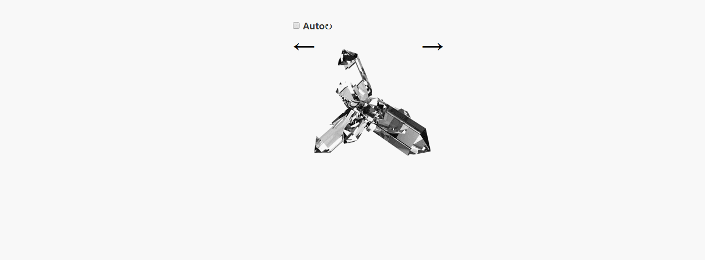

### 水晶石旋转特效

### 实现效果图如下


### 实现代码
```
<!DOCTYPE html>
<html lang="en">

<head>
    <meta charset="UTF-8">
    <title>纯css3水晶石旋转特效</title>
    <!-- <link rel="stylesheet" type="text/css" href="css/cystal-stone.css"> -->
    <style type="text/css">
    * {
        margin: 0px;
        padding: 0px;
    }
    /*去除默认外边距、内边距*/

    body {
        width: 272px;
        margin: 0 auto;
    }

    .auto {
        margin-top: 40px;
    }

    .auto-rotate {
        color: #333;
        font-weight: bold;
        font-family: sans-serif;
    }

    span {
        font-size: 40px;
        color: #000;
        font-weight: bold;
        font-family: sans-serif;
        cursor: pointer;
    }

    .anticlockwise {
        float: left;
    }

    .clockwise {
        float: right
    }

    .rotate {
        width: 273px;
        height: 273px;
        margin: auto;
        background: url("img/cystalStone.jpg") no-repeat;
    }

    .auto:checked~.rotate {
        /*获取所有的选中状态的input标签*/
        -webkit-animation: clockwise 1s steps(30) infinite;
        /*自定义动画：名称 时间 动画分割 无限重复*/
        -moz-animation: clockwise 1s steps(30) infinite;
        -mz-animation: clockwise 1s steps(30) infinite;
        -o-animation: clockwise 1s steps(30) infinite;
    }

    .auto:checked~span {  /* 选中选中框显示和隐藏*/
        display: none;
    }

    .anticlockwise:hover~.rotate { /* 鼠标放到左箭头上,逆时针旋转,背景图片从右到左*/
        animation: anticlockwise 1s steps(30) infinite;
    }

    .clockwise:hover~.rotate {  /* 鼠标放到右箭头上,顺时针旋转,背景图片从左到右*/
        animation: clockwise 1s steps(30) infinite;
    }

    @-webkit-keyframes clockwise {  /*顺时针旋转,背景图片从左到右*/
        0% {
            background-position: 0 0;
        }
        100% {
            background-position: -8192px 0;
        }
    }

    @-webkit-keyframes anticlockwise {
        0% {
            background-position: -8192px 0;
        }
        100% {
            background-position: 0 0;
        }
    }
    </style>
</head>

<body>
    <input type="checkbox" id="auto" class="auto">
    <label class="auto-rotate" for="auto">Auto&#x21bb;</label>
    <br />
    <span class="anticlockwise">&#x2190;</span>
    <span class="clockwise">&#x2192;</span>
    <div class="rotate"></div>
</body>

</html>
```
### 过程分析

* 知识点
  * input中checkbox设置id与label的绑定,可增强用户体验
  * 用伪类,checkbox,实现控制一个子元素的显示和隐藏(当然也可以用js控制)
  * 动画的实现keyframes,注意兼容性`-webkit-keyframes`,动画的格式,永动的动画实现
  * .auto:checked 获取所有的选中状态的input标签
  * ~:获取到后面的所有兄弟元素
  * 把连续的动画放置在同一个位置上播放step(30),把动画分成30个阶段,阶段性的播放